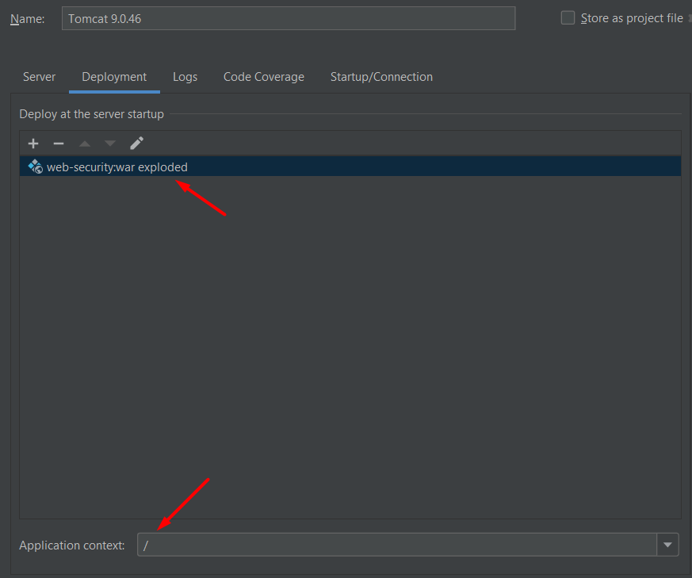

# 
**Cinema** :movie_camera:

##  :speech_balloon: Description
`This is a REST cinema project that allows users to register and authenticate. 
It consists of two roles: user and admin, each with specific limitations in terms of project functionalities. 
For example, the admin can add movies, cinema hall, and movie sessions but does not have access to cart and order-related actions. 
Users can browse and select movies, view available showtimes, add desired tickets to their cart, and make orders. 
For a detailed breakdown of role-based capabilities, please refer to the cinema/config/SecurityConfig file. ` 

## :clipboard: Features
- User registration and authentication as both user and admin
- Adding movies and displaying all previously added movies
- Adding cinema halls and displaying all previously added halls
- User search by email
- Adding, deleting, updating, and searching for available sessions for a specific movie on a given day
- Adding sessions to the shopping cart and viewing the contents of the cart
- Completing an order and reviewing the order history for each user

## :bricks: Project structure
The web-application has 3-tier architecture:
- DAO
- Service
- Controller

There are also relations between the tables. The complete database structure is shown below.

## :globe_with_meridians: Used technologies
- Java 11
- Hibernate
- Spring MVC, Security
- Maven
- MySQL
- Log4j2
- JUnit
- Mockito
- HSQLDB

## :mag_right: Allowed requests
All possible requests are listed below. In `{}` are fields for POST, PUT methods that must be filled in the body of the method in the form of JSON format. 
And `()` contains the names of parameters for GET requests.

POST: /register { “email” , “password” , “repeatPassword”}  
GET: /users/by-email (email) 
GET: /cinema-halls  
POST: /cinema-halls {“capacity”, “description”} 
GET: /movies  
POST: /movies {“ title”, “description”} 
GET: /movie-sessions/available (movieId, date `MANDATORY FORMAT 13-05-2023`) 
POST: /movie-sessions { “movieId” , “cinemaHallId” , “showTime” `MANDATORY FORMAT 2023-05-13T12:30:00`} 
PUT: /movie-sessions/{id} { “movieId” , “cinemaHallId” , “showTime” `MANDATORY FORMAT 2023-05-13T12:30:00`} 
DELETE: /movie-sessions/{id}  
GET: /orders 
POST: /orders/complete 
PUT: /shopping-carts/movie-sessions {“movieSessionId”} 
GET: /shopping-carts/by-user 

## :zap: Setting up
1. The first step is to configure the database connection. To do this, open the file resources/db.properties and enter the correct data for connecting to your database.

2. After that, you need to configure Tomcat **(Use only Tomcat 9)**. To do this, you have to choose `war exploded` and leave only `/` in the application context.
  
3. Before working with this REST application, you will need a request-sending program (such as Postman or similar tools). 
Prior to starting and testing the application, you need to configure the request-sending program. I will demonstrate using Postman as an example.
In this project, there is no option to create a user with an `ADMIN` role using requests. 
However, for convenience during project deployment, a user with the login `admin@i.ua`, password `admin123` and the `ADMIN` role is automatically added to the database `(cinema/security/DataInitializer)`. 
Therefore, you can use these credentials for authentication. But if you want to register a new user, you can do so using the request `http://localhost:8080/register`. 
This is the only request accessible to non-authenticated users. Next, in Postman, you need to go to the `Authorization` tab and select `Basic Auth` then enter the appropriate login and password (see the screenshot below). 
You should perform these steps for all other requests you want to send.
  
**Please note that some requests may be available only to users, while others may be restricted to administrators** `(refer to cinema/config/SecurityConfig)`.
 
###   
Congratulations, the project is ready for use. Enjoy!